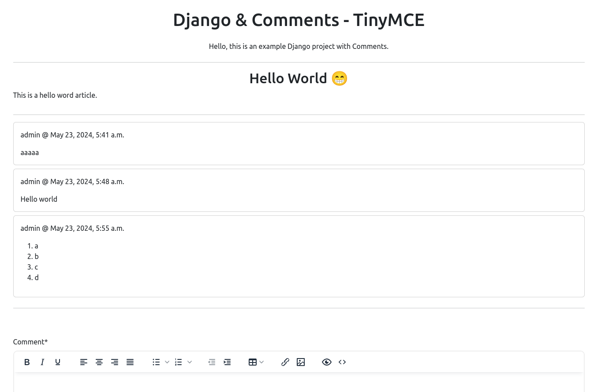

# django-comments


A starter Django project with Comments model and TinyMCE


## Setup Django Project

Create a Python virtual environment,

```bash
$ python3 -m venv .venv
```

Activate the virtual environment,

```bash
$ source .venv/bin/activate
```

Install Python packages,

```bash
$ pip install -r requirements.txt
```

## Run Django Development Server

Run the following command to start the development server,

```bash
$ python manage.py runserver
```

Then visit [`http://127.0.0.1:8000`](http://127.0.0.1:8000)


## Create a Superuser

```bash
$ python manage.py createsuperuser
```

Then you can manage the data via Django admin panel - [`http://127.0.0.1:8000/admin`](http://127.0.0.1:8000/admin)


## Run Django Migration

Make the migration files,

```bash
$ python3 manage.py makemigrations
```

Migrate the models,

```bash
$ python3 migrate.py migrate
```

## Add Article via Django Admin

Go to the admin page [`http://127.0.0.1:8000/admin`](http://127.0.0.1:8000/admin), and add an article there.


## Add Comments to the article

Open the home page [`http://127.0.0.1:8000`](http://127.0.0.1:8000), and you can add comments to the article.

