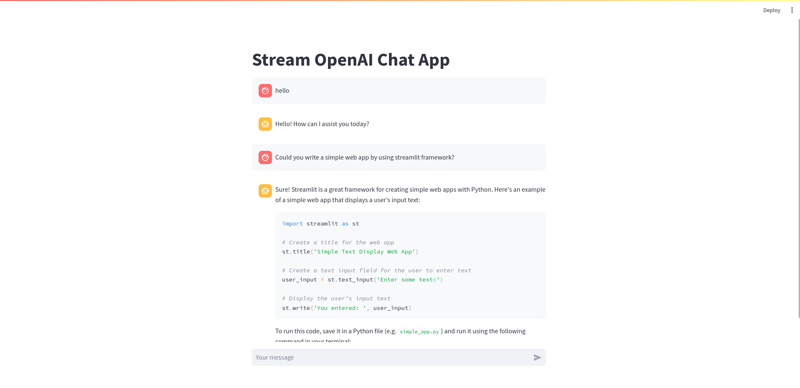

# streamlit-openai


## Setup Development Environment


Enter into the project directory

```cd
$ cd stremlit-openai
```

Create a Python virtual environment,

```bash
$ poetry env use python3.12
```

Activate the Python virtual environment,

```bash
$ poetry shell
```


Install Python packages

```bash
$ poetry install
```

## Setup OpenAI API Key

Open the secrets file of Streamlit on your machine, e.g. `~/.streamlit/secrets.toml`, and put the OpenAI API key there.
```bash
openai_api_key = sk-xxxxxx
```


## Run Streamlit OpanAI app

Run the example app with Streamlit

```bash
$ streamlit run src/streamlit_openai/main.py
```

Then visit `[http://127.0.0.1:8501](http://127.0.0.1:8501).


## Example app screenshot


